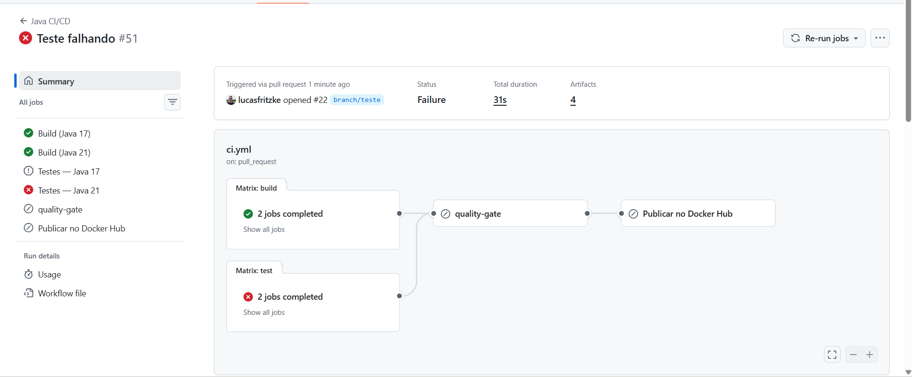

# trabalha-infra-furb
Trabalho desenvolvido para disciplina de Infraestrutura de Tecnologia da Informação e Comunicação
# PontoMed - Sistema de Prontuário Médico

Trabalho desenvolvido para a disciplina de **Infraestrutura de Tecnologia da Informação e Comunicação** – FURB.

## Resumo do projeto

O PontoMed é um sistema web de prontuário médico desenvolvido em Java com Spring Boot, com integração ao PostgreSQL e execução automatizada via GitHub Actions. O projeto expõe endpoints para cadastro e consulta de pacientes e prontuários, além de pipeline de CI/CD para build, testes e publicação de imagem Docker.

## Integrantes

-Nickolas Guenther
-Pablo Gabriel Sautner
-Lucas Fritzke
-Rafael Julio Klug
-Ricardo Nilson Klug

## Stack

- **Linguagem:** Java 17
- **Framework:** Spring Boot 3.2
- **Banco de dados:** PostgreSQL 16
- **Testes:** JUnit 5 + Mockito
- **Containerização:** Docker + Docker Compose
- **CI/CD:** GitHub Actions

## Estrutura do projeto (Bounded Context)

```
src/main/java/br/furb/pontomed/
├── PontoMedApplication.java
├── patient/
│   ├── Patient.java
│   ├── handler/PatientHandler.java
│   ├── repository/PatientRepository.java
│   └── service/PatientService.java
└── medicalrecord/
    ├── MedicalRecord.java
    ├── handler/MedicalRecordHandler.java
    ├── repository/MedicalRecordRepository.java
    └── service/MedicalRecordService.java
```

## Endpoints
### Pacientes (`/api/patients`)

| Método | Rota                    | Descrição                    |
|--------|-------------------------|------------------------------|
| POST   | /api/patients           | Cria novo paciente           |
| GET    | /api/patients          | Lista todos os pacientes     |
| GET    | /api/patients/{id}     | Busca paciente por ID        |
| GET    | /api/patients/cpf/{cpf}| Busca paciente por CPF       |
| PUT    | /api/patients/{id}     | Atualiza paciente            |
| DELETE | /api/patients/{id}     | Remove paciente              |

### Prontuários (Medical Records)

Todos os endpoints de prontuário usam o prefixo `/api`.

| Método | Rota                                    | Descrição                        |
|--------|-----------------------------------------|----------------------------------|
| POST   | /api/patients/{patientId}/records       | Cria prontuário para paciente    |
| GET    | /api/records                            | Lista todos os prontuários       |
| GET    | /api/records/{id}                       | Busca prontuário por ID          |
| GET    | /api/patients/{patientId}/records       | Lista prontuários de um paciente |
| PUT    | /api/records/{id}                       | Atualiza prontuário              |
| DELETE | /api/records/{id}                       | Remove prontuário                |

## Payloads para teste

Use estes exemplos no Postman, Insomnia ou `curl` para testar a API.

### Criar paciente

```json
{
    "name": "Maria Silva",
    "cpf": "12345678901",
    "birthDate": "1995-08-20",
    "email": "maria.silva@email.com",
    "phone": "47999998888"
}
```

### Atualizar paciente

```json
{
    "name": "Maria Silva Souza",
    "cpf": "12345678901",
    "birthDate": "1995-08-20",
    "email": "maria.silva@email.com",
    "phone": "47999998888"
}
```

### Criar prontuário

Envie este payload em `POST /api/patients/{patientId}/records`.

```json
{
    "description": "Paciente relatou dor de cabeça e febre há 2 dias.",
    "diagnosis": "Suspeita de infecção viral"
}
```

### Atualizar prontuário

```json
{
    "description": "Paciente relatou melhora dos sintomas após medicação.",
    "diagnosis": "Quadro em regressão",
    "recordDate": "2026-05-13T14:30:00"
}
```

Observação: no `PUT /api/records/{id}`, o campo `recordDate` deve ser enviado porque o serviço atualiza esse valor junto com `description` e `diagnosis`.

### Exemplo com `curl`

```bash
curl -X POST http://localhost:8080/api/patients \
    -H "Content-Type: application/json" \
    -d '{
        "name": "Maria Silva",
        "cpf": "12345678901",
        "birthDate": "1995-08-20",
        "email": "maria.silva@email.com",
        "phone": "47999998888"
    }'
```

```bash
curl -X POST http://localhost:8080/api/patients/1/records \
    -H "Content-Type: application/json" \
    -d '{
        "description": "Paciente relatou dor de cabeça e febre há 2 dias.",
        "diagnosis": "Suspeita de infecção viral"
    }'
```

## Como executar

### Com Docker Compose
[Acesse o arquivo docker-compose.yml do projeto](pontomed/docker-compose.yml)

```bash
docker compose up
```

A aplicação ficará disponível em `http://localhost:8080`.


## Variáveis de ambiente

| Variável      | Padrão                              |
|---------------|-------------------------------------|
| `DB_URL`      | `jdbc:postgresql://localhost:5432/pontomed`
| `DB_USERNAME` | `postgres`                          |
| `DB_PASSWORD` | `postgres`                          |
| `DB_NAME`     | `pontomed`                          |

## Arquivo .env

O projeto usa um arquivo `.env` na raiz para fornecer as credenciais ao Docker Compose e à aplicação. Siga estes passos antes de executar o projeto com Docker Compose:

- Copie o arquivo de exemplo para criar o `.env` localmente:

```bash
cp .env.example .env        # Unix / macOS
Copy-Item .env.example .env # PowerShell
copy .env.example .env      # CMD
```

- Abra o arquivo `.env` e preencha as variáveis com as credenciais do banco. Para o ambiente Docker usado pelo professor, insira exatamente:

```
DB_URL=jdbc:postgresql://db:5432/pontomed
DB_USERNAME=postgres
DB_PASSWORD=postgres
DB_NAME=pontomed
```

- Certifique-se de que o arquivo `.env` esteja na raiz do repositório (mesma pasta de `docker-compose.yml`).

- O repositório contém um arquivo `.env.example` com as chaves vazias para referência:

```
DB_URL=
DB_USERNAME=
DB_PASSWORD=
DB_NAME=
```

## Respostas para o relatório CI/CD

1. O que acontece se um teste falhar propositalmente?

    Se um teste falhar, o comando `mvn test` retorna erro e o job de testes falha. No workflow atual, isso interrompe a validação do pipeline e impede que o PR siga para merge ou que o job de CD seja executado.
    
    
    
    

2. Em que cenário real a publicação de artefatos seria útil?

    A publicação de artefatos é útil para disponibilizar o `.jar` gerado pelo build para download, auditoria, validação manual, distribuição para homologação ou reutilização em ambientes diferentes sem recompilar.

3. Se um teste falhar, o que acontece?

    Se um teste falhar, o job de testes é interrompido e marcado como falha no Actions, também é bloqueado a execução de jobs dependentes como o quality-gate, se o erro ocorrer dentro do pull request e o sistema impedirá o merge do código.

Teste falhando propositalmente:


Reversão teste funcionando novamente:


5. Por que nunca devemos commitar credenciais no código?

    Porque o histórico do Git é permanente — mesmo que você delete o arquivo depois, a credencial continua acessível via git log. Repositórios públicos expõem isso para qualquer pessoa, e repositórios privados expõem para todos os colaboradores. Bots varrem o GitHub em tempo real procurando exatamente isso.


6. Foram testadas quais versões do Java?

    Foram testadas as versões Java 17 e Java 21 via strategy.matrix. Nenhuma diferença de comportamento foi observada entre as duas versões — todos os builds e testes unitários passaram de forma idêntica em ambas.

    Isso era esperado, pois o código não utiliza nenhuma API removida ou alterada entre o Java 17 e o Java 21. O Spring Boot 4.0.6 é compatível com ambas as versões, assim como o JUnit 5 e o Mockito utilizados nos testes.

    A matrix serve, portanto, como garantia proativa: caso uma dependência futura introduza incompatibilidade com o Java 21, o pipeline detectará o problema antes que chegue à branch main.

7.

    

8. Por que paralelismo importa em pipelines de CI?

    O paralelismo importa porque reduz drasticamente o tempo de espera, permite a validação rápida em múltiplos ambientes e garante que o fluxo de entrega (CD) só receba códigos que foram validados em paralelo.

9. Qual a diferença entre uma tag latest e uma tag por SHA? Quando usar cada uma?

    Use latest para facilitar testes rápidos e consumo da versão mais atual. Use a tag por SHA quando precisar de rastreabilidade, rollback, auditoria ou garantia de que a imagem é exatamente aquela gerada por um commit.

10. Como funciona o workflow configurado no GitHub Actions?

    O workflow `ci.yml` é disparado em push em qualquer branch, executa build e testes em matriz de Java 17/21, publica os artefatos do build e, na branch `main`, publica a imagem Docker quando build e testes passam. O workflow `pr.yml` roda em pull requests para `main` e serve como verificação obrigatória antes do merge.

11. O que cada job e step do arquivo YAML faz?

    No `ci.yml`, o job `build` baixa o repositório, configura Java na matriz 17/21, executa `mvn clean package -DskipTests` e publica o `.jar`. O job `test` faz checkout, configura Java 17/21, executa `mvn test` e salva os relatórios do Surefire. O job `docker` depende de `build` e `test`, roda apenas na `main`, faz login no Docker Hub e publica a imagem com as tags `latest` e `${{ github.sha }}`. No `pr.yml`, os jobs `build` e `test` rodam em PRs para `main` e o job `quality-gate` sinaliza que o PR pode ser aprovado quando tudo passar.

12. Quais foram os aprendizados e dificuldades encontradas no projeto?

    Os principais aprendizados foram estruturar uma aplicação Java com banco de dados, organizar endpoints e alinhar CI/CD com o código. As principais dificuldades costumam estar em configurar o workflow, secrets, banco local, matriz de versões e manter a documentação sincronizada com a implementação.
